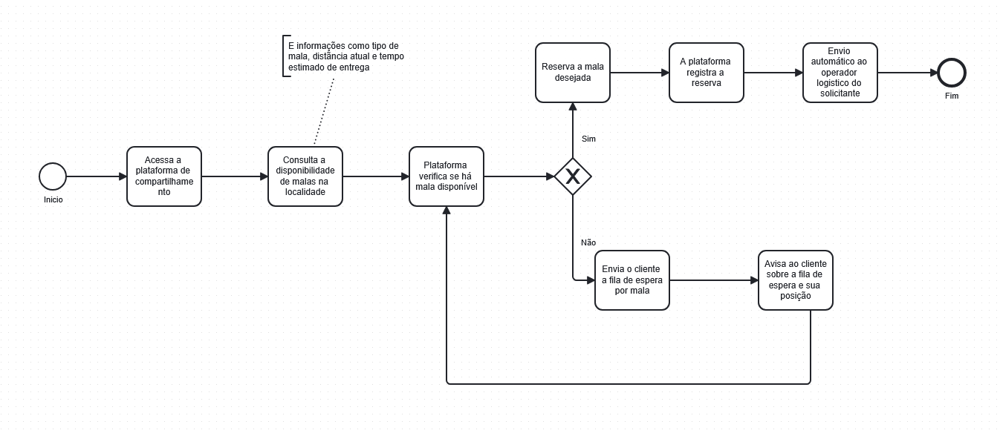
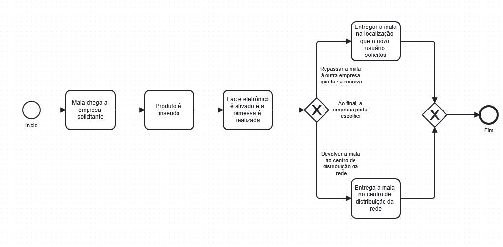
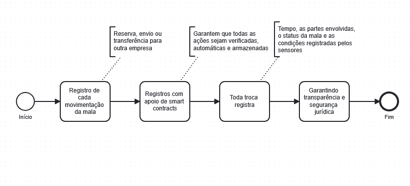
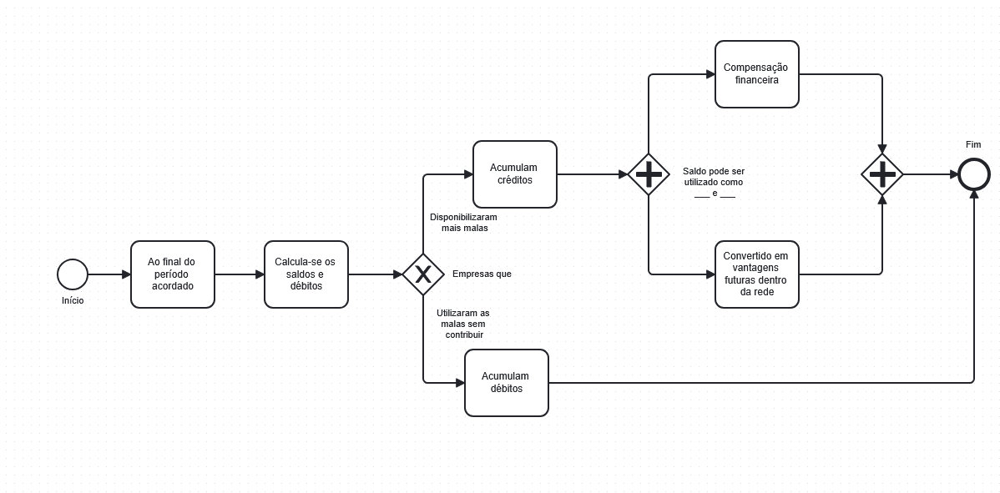

# Modelos BPMN da Plataforma de Compartilhamento de Malas Inteligentes

Esta pasta contém os diagramas BPMN (Business Process Model and Notation) que representam os processos de negócio da nossa Plataforma de Compartilhamento de Malas Inteligentes. Cada diagrama ilustra o fluxo de atividades, os participantes (piscinas e raias), eventos e decisões, conforme descrito no documento de especificação.

Os processos foram modelados para garantir clareza, coerência e a representação adequada das colaborações e subprocessos envolvidos.

## Diagramas de Processo

Aqui estão os modelos BPMN desenvolvidos para cada etapa chave do funcionamento da plataforma:

### 1. Processo de Reserva de Mala
* **Descrição:** Este diagrama detalha como uma empresa participante da rede acessa a plataforma, consulta a disponibilidade de malas e realiza a reserva para um envio.
* **Imagem:**
    

### 2. Processo de Recebimento e Preparação de Envio
* **Descrição:** Este diagrama ilustra as etapas desde o recebimento da mala entregue pelo operador logístico até a preparação do produto para envio e a ativação do lacre de segurança.
* **Imagem:**
    

### 3. Processo de Envio e Transferência (Ciclo de Uso Colaborativo)
* **Descrição:** Este diagrama mostra o fluxo do envio do produto, o monitoramento e as opções de destinação da mala após o uso, seja para devolução ao centro de distribuição ou transferência direta para outra empresa.
* **Imagem:**
    

### 4. Processo de Acompanhamento da Gestão de Saldo (Créditos/Débitos)
* **Descrição:** Este diagrama explica como as transações são registradas, como o sistema calcula os saldos de créditos e débitos entre as empresas, e como essas informações podem ser utilizadas para decisões estratégicas.
* **Imagem:**
    

---
